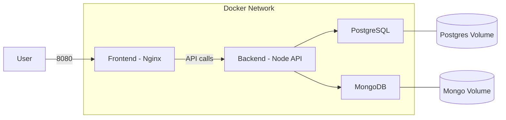

# PLAYMARKET - Déploiement Docker

## Prérequis

- Docker version 24.0 ou supérieure
- Docker Compose version 2.0 ou supérieure
- Linux, macOS ou Windows (avec Docker Desktop)

Vérification :
```bash
docker --version
docker compose version
```

## Procédure de build et de lancement

### 1. Configuration

```bash
cp .env.example .env
```

Éditer `.env` et configurer les variables (mots de passe, secrets JWT).

### 2. Build et démarrage

```bash
docker compose up --build
```

### 3. Arrêt

```bash
docker compose down
```

## Description des services

### Frontend
- **Technologie** : React (Vite) servi par Nginx
- **Port** : 8080
- **Accès** : http://localhost:8080

### Backend
- **Technologie** : Node.js / Express
- **Port** : 3000
- **Accès** : http://localhost:3000
- **Endpoints** : `/api/auth`, `/api/games`, `/api/users`, `/api/orders`, `/api/mongo`

### PostgreSQL
- **Image** : postgres:16-alpine
- **Port interne** : 5432
- **Volume** : `postgres_data` (persistance)

### MongoDB
- **Image** : mongo:7
- **Port interne** : 27017
- **Volume** : `mongo_data` (persistance)

## Variables d'environnement

| Variable | Description |
|----------|-------------|
| `NODE_ENV` | Environnement (development/production) |
| `PORT` | Port backend (défaut: 3000) |
| `FRONTEND_PORT` | Port frontend (défaut: 8080) |
| `PG_HOST` | Hôte PostgreSQL (défaut: postgres) |
| `PG_PORT` | Port PostgreSQL (défaut: 5432) |
| `PG_DATABASE` | Nom base PostgreSQL |
| `PG_USER` | Utilisateur PostgreSQL |
| `PG_PASSWORD` | Mot de passe PostgreSQL |
| `MONGODB_URI` | URI MongoDB (ex: mongodb://mongo:27017/playmarket) |
| `JWT_SECRET` | Secret JWT (minimum 32 caractères) |
| `JWT_REFRESH_SECRET` | Secret refresh token (minimum 32 caractères) |
| `ALLOWED_ORIGINS` | Origines CORS (défaut: http://localhost:8080) |

## Schéma d'architecture



Volumes:
- postgres_data → persistance PostgreSQL
- mongo_data → persistance MongoDB

Flux:
1. Client → Frontend (http://localhost:8080)
2. Frontend → Backend (proxy /api → backend:3000)
3. Backend → PostgreSQL (réseau Docker)
4. Backend → MongoDB (réseau Docker)

## Explication des choix techniques

### Multi-stage builds
Réduction de la taille des images finales en séparant la phase de build de la phase de production.

### Images Alpine
Images légères et sécurisées pour réduire la surface d'attaque.

### Utilisateur non-root
Le backend s'exécute avec un utilisateur non-privilégié (UID 1001) pour renforcer la sécurité.

### Réseau user-defined bridge
Réseau isolé (`playmarket-network`) permettant la communication sécurisée entre conteneurs via DNS interne.

### Volumes nommés
Persistance des données des bases de données via volumes Docker nommés.

### Healthchecks
Vérifications de santé sur PostgreSQL et MongoDB pour garantir un démarrage ordonné des services.

### Initialisation automatique des bases de données
Les scripts d'initialisation sont montés dans les conteneurs de bases de données :
- **PostgreSQL** : Les fichiers `.sql` dans `/docker-entrypoint-initdb.d/` sont exécutés automatiquement au premier démarrage
- **MongoDB** : Les fichiers `.js` dans `/docker-entrypoint-initdb.d/` sont exécutés automatiquement au premier démarrage

## Sécurité et bonnes pratiques

- Variables sensibles dans `.env` (non versionné via `.gitignore`)
- Backend exécuté avec utilisateur non-root
- Images officielles Alpine
- Aucun mot de passe en clair dans le dépôt
- Réseau Docker isolé
